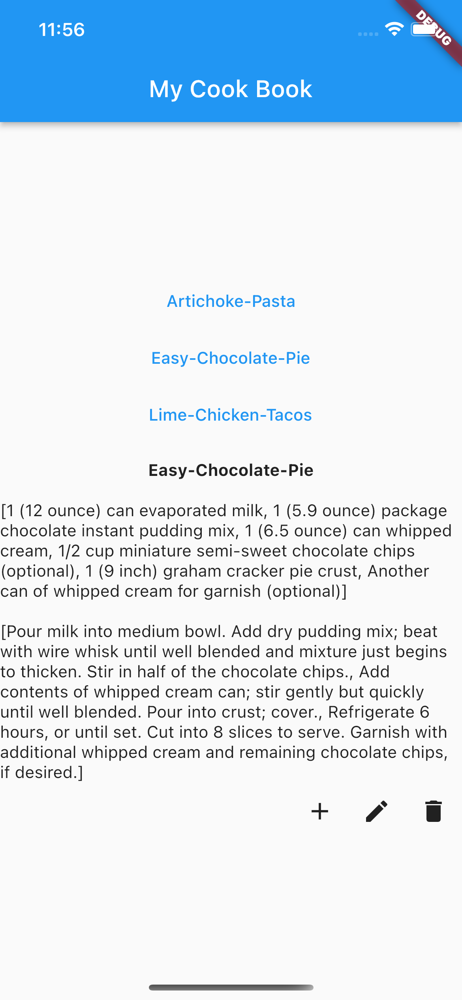
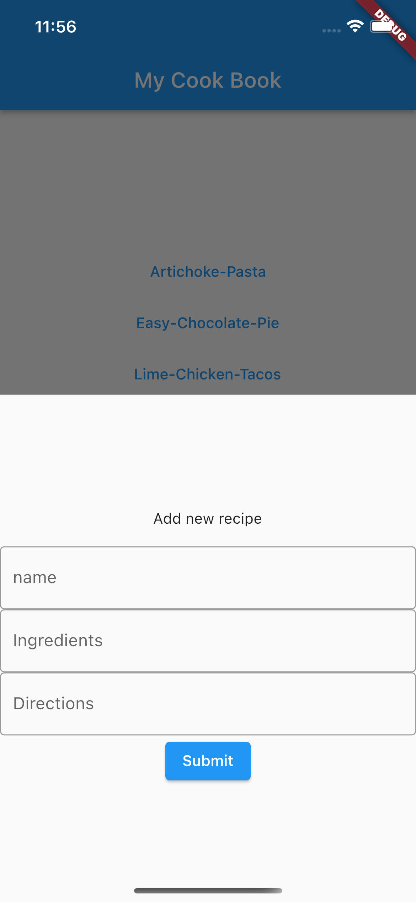

# Flutter Cook Book

Inspired by this app built with react https://codepen.io/freeCodeCamp/full/dNVazZ/
Designed for IOS, Android, and Web

# Try Me
https://ljsimpkin.github.io/Recipe-Box-WebApp/#/

## Getting Started

This project is a starting point for a Flutter application.

A few resources to get you started if this is your first Flutter project:

- [Lab: Write your first Flutter app](https://flutter.dev/docs/get-started/codelab)

For help getting started with Flutter, view our
[online documentation](https://flutter.dev/docs), which offers tutorials,
samples, guidance on mobile development, and a full API reference.

Next steps: 
Persistant local storage using SQLite
Even more error checking!
